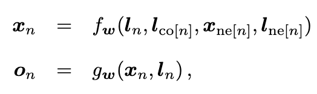
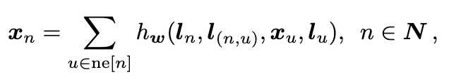
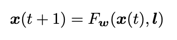

### Introduction

图神经网络是用图表示数据与数据之间关系的神经网络模型。

许多领域内的数据之间的关系可以用图来表示，例如图像中概念的景深关系、句子中实体的依存关系等。GNN 将一般的神经网络拓展为可以处理图形式的输入数据，对用图表示的数据关系进行建模，输出融合了上下文信息的数据表示。

### Graph Nerual Network Model

#### Graph Model

图由顶点集和边集组成，顶点和边都可能包含标签。标签一般表示某种属性，如某条边的标签可能是两个物品之间的距离。那么在监督学习框架下，每个学习样本由顶点和它的标签组成，标签为监督信号。

在图表示下，我们的直觉是每个顶点表示一种物体或概念，边表示概念之间的关系，而每个概念可以由它自身的特征和相关的概念来定义。我们用状态向量来表示每个顶点，这个状态向量由邻域内所包含的信息决定。这个状态向量可以表示这个顶点所代表的概念，可以用来产生一个输出，表示根据这个概念进行的决策。

顶点与邻域的依赖关系可以用带参数的函数 fw 描述，我们称之为局部转移函数。基于顶点状态进行决策可以由带参数的函数 gw 表示，我们称它为局部输出函数。

这里 l 表示标签，co[n] 表示连接顶点 n 的边的集合，ne[n] 表示顶点 n 的邻接顶点，Xne[n] 与 lne[n] 分别表示由邻接顶点的状态向量和标签堆叠起来的向量。

当处理位置无关图时，局部转移函数可以简化为

在这种形式的转移函数下，邻接顶点的顺序不影响顶点 n 的状态。

那么实现 GNN 需要考虑以下 3 个方面：

1）如何求解状态向量；

2）如何用训练样本调整转移函数和输出函数的参数；

3）如何实现转移函数和输出函数。

#### 状态向量计算

状态向量可以由迭代算法求解

Banach’s Fixed Point theorem 表明只要 Fw 是个收缩映射，那么对于任何初始状态 x(0) 状态向量 x(t) 都能以指数速度收敛。

#### 学习算法

图模型的学习是调整参数使得预测结果接近学习目标的过程。一共包括三步：

1）状态向量的迭代更新；

2）图模型的前向和反向传播；

3）参数更新。

由于迭代更新时需要存储状态变量用于梯度反向传播，内存消耗量会随着迭代次数的增加而增加。好在可以证明经过少量迭代后状态向量就可以趋近稳定点。

#### GNN 实现

GNN 的实现包括转移函数和输出函数的实现。输出函数的实现没有限制，这里为多层感知机。而转移函数对于状态变量需要是一个压缩映射才能使状态向量经过迭代更新可以趋于稳定点。
